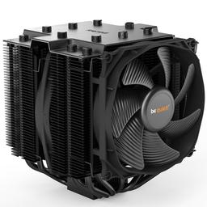
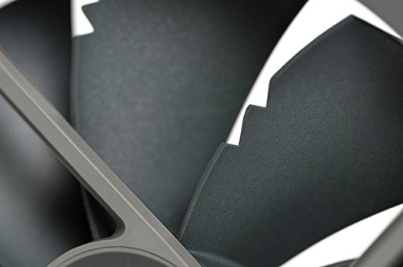

# Cooling

|[Home](README.md) | 
| -------- |

| |   |
| --- | --- |
| CPU cooler: *be quiet! Dark Rock Pro 4 50.5 CFM CPU Cooler* | Case fan: *Noctua P14s redux-1500 PWM 78.69 CFM 140 mm Fan* |

### What is Cooling?
Simply put, cooling is something put into place in a computer that faciliates the cooling of the components. Cooling can be focused on specific components, but it should, overall, cool the entire system and prevent overheating.

Overheating is bad for the computer because it slowly destroys the components. Computer components are not meant to withstand a certain amount of heat. If heat exceeds their threshold, the component will slowly be destroyed by the heat. This can result in slower or degraded performance or even full failure.

Laptops are prone to overheating as their cooling systems are so compact that some heat cannot be dealt with properly. Laptop cooling is also pretty much uncustomizable due to the laptop's thinness. You can, however, clean the fans in the laptop if you know what you are doing. Dust, hair, and dirt accumulate over time in the laptop fans, and you will see an improved cooling if these fans are cleaned.

PCs allow for more customizability with cooling systems as PC users can choose between water and fan cooling. Furthermore, PC cooling can be later customized and clean due to the easy detatchment of the case and subsequent components.

It is worth noting that there some components that can be individually cooled to produce less heat and those are the CPU, GPU, and the northbridge. Sometimes these components even come with fans attached to help with cooling. You will want to choose a dedicated CPU cooler, though, due the fact that this is often the hottest and the most important component in a build.

### Liquid vs. Air Cooling
If you have ever shopped for or heard about PCs, you probably have heard about liquid cooling and air cooling. Liquid cooling is the newer, more expensive cooling format that uses the transportation of water from one area to another to asorb heat. Essentially, the cool liquid being passed through the computer will asorb the heat being spread by the components and the heat will eventually be converted back into cool liquid. Air cooling is when you use fans to push the hot air away from the components and out of the case. Ideally, you will create a good airflow system that constantly pushes hot air out and cool air in that effectively reaches all heat producing components.

Both of these cooling types should be focused on cooling the CPU, but also reducing overall heat in the case.

Which is better?
| Category | Liquid | Air |
| --- | --- |  --- |
| Price |  | X |
| Installation |  | X |
| Maintenance |  | X |
| Noise | X |  |
| Effectiveness | X |  |
| Appearance | X |  |

What type of cooling you get should depend upon your needs and finances. You will have to consider what will fit into your case and how you want to set up the fans or the liquid. For air cooling, look into proper airflow to ensure that your computer is being accurately cooled.