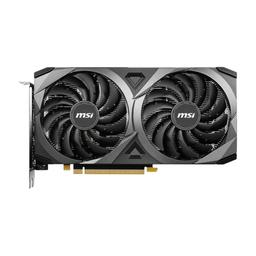

# Graphics Processing Unit (GPU)

|[Home](README.md) | 
| -------- |

  
*MSI GeForce RTX 3060 Ventus 2X 12G GeForce RTX 3060 12GB 12 GB Video Card*

### What is a GPU?
Firstly, it is important to specify that when a lot of people talk about GPUs, they are talking about the full video card/graphics card rather than the GPU alone. The GPU is a circuit that alters memory to create images intended for output. It is a specific unit within a video card. A video card is an expansion card that outputs images to a display. A video card can include a built-in fan and can render things other than images. 

The GPU is the processing unit that can parallel process and it focuses on graphics rendering. GPUs are especially important in gaming and media production, specifically full stack development and video rendering. The GPU works alongside the CPU to process tasks. The GPU focuses on graphics tasks while the CPU typically takes logic tasks.

The GPU is connected to the [motherboard](motherboard.md) by PCIe slots. The PCIe speeds are dependent on the motherboard's speed, *not* the GPU's speed. If the PCIe generation of the motherboard is lower than the GPU's PCIe generation, it will run at the slower motherboard speed and create a chokepoint.

Some GPUs are integrated which means they are integrated into the CPU. In this case, there is no graphics card as the GPU is part of the CPU. The advantages of this are that it allows for thinner computers and less power consumptions. The disadvantage of this is that integrated graphics are typically unable to handle heavier graphics tasks compared to a dedicated graphics card. Intel is the main developer of integrated graphics. MacBooks are an example of a laptop with integrated graphics. Before the M series (M1, M2, M3) MacBooks, most MacBooks had integrated Intel graphics. Apple's M series are also an example of integrated graphics.

Like most computer components, laptop GPUs are often not customizable due to the laptop's manufacturing and size. Most laptop makers offer different models or types of models with various GPU selection options. This is the main way to choose what GPU you get in a laptop.

### GPU Memory
When you look at GPUs, you will often see a measure of memory in the GPU's name. For example, the GPU often referred to as the 4090 has a full title of: **Founders Edition NVIDIA GeForce RTX 4090 24GB GDDR6X Graphics Card**. If you notice, this title mentions "24GB" which sounds like the storage size that your computer or phone has. This part of the title denotes the amount of memory (measured in GB), rather than storage, that the GPU has.

Much like typical [RAM](memory.md) used in computer processing, video cards have VRAM that store processes in memory based on the memory type and size. The more memory the GPU has, the more processes it can hold. This means that a GPU with a higher memory can hold larger graphics tasks than a GPU with less memory. As such, video game and video editing often require a GPU memory of 8GB or higher to even process the graphics properly. Anything more than 8GB allows for better processing; therefore, smoother frames and sharper details.

Furthermore, the title mentions "GDDR6X" which is similar to the RAM memory type denotations. In this case, this denotes that the 4090 has a GPU VRAM type of GDDR6X which is one of the newest and fastest memory types out currently.

### GPU Cores
One other thing you might have noticed is that the GPU (the actual unit, not the card) has cores like a [CPU](cpu.md) would. This is because a GPU *does* have cores. Like a CPU, the more cores often mean the better performance by the GPU. One of the most famous core types is the CUDA cores. These are produced by NVIDIA, and the NVIDIA GeForce, Quadro, and Tesla GPUs have these cores. CUDA cores are known for performing complex calculations faster than the competitors with the biggest drawback being the significant price of such a GPU.