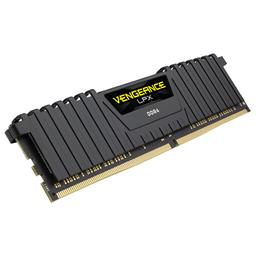

# Random Access Memory (RAM)

|[Home](README.md) | 
| -------- |

   
*Corsair Vengeance LPX 64 GB (2 x 32 GB) DDR4-3600 CL18 Memory*

### What is RAM?
When looking at computers, you will see two different things that have measurements of MB/GB. One of them is storage, how much your computer can hold at all times. Another is memory, also known as RAM, which is the amount of data that can be used and held by the computer at one time. 

Think of memory as, well, a memory that your brain has just remembered. This is something that your brain was able to pull out of your collective memories and thoughts (i.e. storage), and you are able to recall this memory instantly and use it how you like. Memory is like the collection of thoughts your brain can put to the forefront of your mind. It is something you do not always have pulled up, but it is something you can recall if needed. It is something that is not always at the forefront of your mind, and can be returned to its place in your mind once you are done looking at it. 

RAM is this but for computers. It is the computer's capacity to recall and grab information in storage and use it. You can run many different pieces of information at once and use them in whatever way you want. Once you are done with this, you return the edited information into storage. 

### Types
There are different types of RAM. These are often denoted in the full name of the RAM and will often look like three capital letters and a number. The types of RAM differ in their read/write speeds to the storage and how they access the storage. The most common type of RAM right now is DDR4. The type of RAM your computer can use is dependent upon your [motherboard](motherboard.md). The motherboard will dictate what type of RAM you can put in it, and it dictates the read/write speed of the RAM. If you have a DDR3 motherboard but a DDR4 RAM, your memory will run at DDR3 speeds. This will create a chokepoint in the computer architecture. Laptop users do not need to worry about this as the computer is prebuilt, but this is something to seriously consider in PC building.

### Size
Unlike brains, you can increase the number of simultaneous tasks or thoughts that your computer can have. You do this by increasing the memory size. The size of the RAM is important when you will be running many different tasks that require data recall. For things like checking email or watching videos, you do not need a lot of RAM. For things like working on video editing or animation where many different things are being recalled, a larger memory is necessary. Like most things, the larger size of RAM, the more expensive it is. The best way to choose RAM is to base it off of your motherboard and what you need from your computer.
