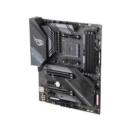

# Motherboard

|[Home](README.md) | 
| -------- |

  
*Asus ROG Strix X570-E Gaming ATX AM4 Motherboard*

### What is a motherboard?

A motherboard is essentially the veins of a computer. It  connects different components, and it determines the size and capability of a computer. The motherboard maintains connections between the internal components of the computer and the [peripherals](peripherals.md). It determines the number of components in a computer, and the type of components that can be used in a computer.

### Form factor
A computer's motherboard dictates the size of the computer. This is called form factor. Form factor determines the shape, size, and potential power supply type of the motherboard. There are three main form factors:
- mini-ITX
- micro-ATX
- ATX
- E-ATX

Mini-ITX is used for small, low-cost PCs. Its size limits the potential capabilities and connections of the computer compared to the other form factor types; although, this form factor does support moderate gaming if other components are chosen correctly.

Micro-ATX is also a smaller form factor. This form has the same type of features as the typical ATX, but it is suited for a less powerful, smaller set up due to less PCIe lanes. This form is slightly larger than Mini-ITX, so it cannot fit in the same case as those forms. This form is of the ATX type, so it can fit in mid-tower or larger cases.

ATX is the most common form factor used. This is the type of motherboard you will often see in gaming set ups. It allows for more than one GPU and has multiple PCIe lanes. It also supports the overclocking used in gaming. This form is for people who want to take advantage of their components.

E-ATX form factor is the largest common form factor. This motherboard is suited towards people who want to really push their components or put together a complicated PC. 

**Note:** Laptops do not have form factors. This is because they are designed to fit within their specific laptop case. 

### Chipset
On a PC motherboard, there are two chips in the chipset architecture that dictate the data flow between the processor, memory, and peripherals. The northbridge is directly connected to the CPU by the front-side bus and is responsible for tasks that ask for high performance. Alternatively, the southbridge controls mainly input/output (I/O) functions.

These chips work together to manage communication between the CPU and other parts of the motherboard to form the logic chipset.

This chipset will be different depending on the manufacturer of the motherboard/the intended CPU for the motherboard. The two main chipsets are Intel and AMD, and these chipsets are found on various other-party motherboards. As such, when building a PC, you must keep in mind what chipset your motherboard has and if it will be compatible with the CPU you want. Laptops have chipsets too, but they are predetermined by the type of laptop you are buying.

### Basic Input/Output System (BIOS) 
BIOS is the firmware that initializes  hardware upon startup/boot up. It is stored in a memory chip or flash memory on the motherboard. BIOS is essentially the connector between software and hardware as it checks that each hardware component is working up to spec and that it can work with the computer's software. Both laptops and PCs have BIOS as it is required to help the computer run properly.

If you build a PC, you will want to check BIOS upon start up to ensure that all the components you attached run properly. If your BIOS does not run correctly, this can result in major problems with your computer or a complete brick of your computer. 

### Network Interface Controller (NIC)
The NIC is a computer component that connects the computer to a network. Older computers required the NIC to be bought and installed/connected separately, but most modern motherboards have NIC already installed on them. All computers require a NIC of some kind to be able to connect to the Internet. Most laptops and PCs will have a wireless NIC and a wired NIC that allows for both wireless (Wi-Fi) connections and wired (Ethernet) connections. When building a computer, you will want to make sure you have a NIC included in the motherboard, and that it is the type of NIC you want. Otherwise, you will have to add on the type of NIC you want to the motherboard.

### Sound Cards
Sound cards are expansion cards that process audio input and output signals. For PCs, sound cards are not commonly included with the motherboard. There are some motherboards that do include sound cards, but it is suggested for PC builders to choose their own sound cars for their own needs. 

Sound cards *are* included in laptop motherboards, or the audio controls are integrated in the motherboard in some other way. Laptops do not need sound cards, and connecting one is often unnecessary. Instead of a sound card, you would want to connect a better speaker or microphone to your laptop's external bus connectors for better audio input/output.

### Peripheral Component Interconnect Express (PCIe)
PCIe is a standard for the bus connectors on a motherboard. PCIe connects things like the GPU, storage, sound card, controller cards, etc. to the motherboard. These are direct connectors to the motherboard, and the amount of PCIe slots depends upon the motherboard. When understanding the differences in PCIe types, the main thing to know is that there are different generations of PCIe standard and different types of PCIe slots.

PCIe generations are different releases of PCIe over the years. Each generation is faster than the previous generation as each generation has higher data transfer rates. 

The newest generation is PCIe 6.0, but the most common PCIe generations supported in motherboards are PCIe 3.0 and 4.0. There are motherboards that support PCIe 5.0, but this is less common due cost and the fact that many components do not have PCIe 5.0 connectors which makes the faster lanes redundant. 

PCIe slot size is denoted in factors of 2 with a preceding X. For example, PCIe x16 vs x4. Slot size is exactly as it sounds; the larger the number after the x, the more pins the slot has and the larger the slot is. Some motherboards only have smaller PCIe slots while other motherboards have multiple, large x16 slots.

Laptops and PCs both have PCIe slots, the difference is that you cannot connect new things to your laptop PCIe lanes easily. This would require disassembling and rearranging the way your laptop works. In PC building, the PCIe slots of a motherboard must be considered when buying computer components. What type of slots and how many slots will dictate how strong the computer will be.

### Connections Bus Types
A bus is a communication system that transfers data from components inside a computer. There are internal and external buses on a motherboard. Examples of a bus are SATA and USB and the aforementioned PCIe.