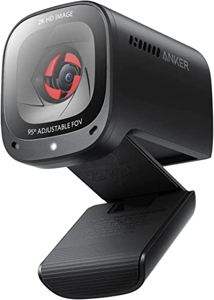

# Peripherals

|[Home](README.md) | 
| -------- |

|  |  |  |  | 
| --- | --- | --- | --- |
| *LG 27GN800-B 27.0" 2560 x 1440 144 Hz Monitor* | *HP 631341-B21 Wired Standard Keyboard With Laser Mouse* | *HP HyperX Cloud II 7.1 Channel Headset* | *Anker PowerConf C200 Webcam* |

### What are Peripherals?
Peripherals are simply the external components of a computer. These often do not connect directly into the motherboard, but are connected to the motherboard via the case. Common examples of these are keyboards, mice, monitors, microphones, speakers, and cameras.

What type of peripherals to get depends upon the build. As mentioned in the [case](case.md) article, you have to consider the case ports when choosing your peripherals. Additionally, you have to consider the power of you peripherals to the power of your hardware. Most GPUs can produce 4K images, but not all monitors can. In this case, there is a bottleneck here as your monitors are unable to perform to the maximum capabilities of your GPU. That said, choosing better peripherals mean spending more money. You will have to decide on whether or not better peripherals are worth it and if the components you chose can meet that expectation.

You can add peripherals to laptops, but, like PCs, you have to consider the number of ports your laptop shell has. Additionally, most laptops have many common peripherals integrated into the shell already like a microphone, speaker, and camera. Additional peripherals must be connected via the shell of the laptop.