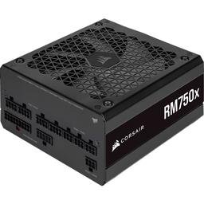

# Power Supply Unit (PSU)

|[Home](README.md) | 
| -------- |

  
*Corsair RM750x (2021) 750 W 80+ Gold Certified Fully Modular ATX Power Supply*

### What does a PSU do?
A PSU converts the AC current from the wall the computer is plugged into and turns it into regulated DC power to better power the computer components. Some PSUs have manual switches for input voltage while others automaticallh adapt to main voltage.

### Compatibility
The PSU is one of the last things you will want to consider when building a computer. This is because the wattage of the PSU depends on all other expected computer components, and you will need to determine the type of cables needed to connect the PSU to the motherboard, CPU, GPU, SATA, and other connectors.

As far as wattage goes, you will often want to add 100W or 150W to your expected wattage to determine the wattage of the PSU. It is better to choose a PSU with a larger wattage than expected than to get a PSU with at exact or lesser wattage than what your computer will need.

### Efficiency Rating
There are different efficiency ratings that a PSU can have. These ratings are least to most efficient:
- 80 PLUS
- 80 PLUS Bronze
- 80 PLUS Silver
- 80 PLUS Gold
- 80 PLUS Platinum
- 80 PLUS Titanium
A more efficient PSU will use less power and generate less heat. It will also be more expensive. Most PSUs come with fans as well, but when you build your PC, you will want to consider additional [cooling](cooler.md) depending on the efficiency of your PSU.

### Form Factor
The size of your PSU matters as it will dictate whether or not it will fit into your case and actually transfer power from your case to your computer. Most PSUs are compatible with ATX[^1], but micro-ATX and mini-ITX might have issues with fitting the PSU into the smaller cases.

### PSU vs Battery
It is worth noting that laptops do not have PSUs because they are equipped with batteries that gain charge via external power supply. This is because laptops are meant to be portable and PCs are not. Adjusting your laptop to include a PSU pretty much negates the point of having a laptop.

**IMPORTANT NOTE FOR LAPTOP USERS:** If you own a laptop, do **NOT** overcharge your laptop/leave it plugged in overnight. This constantly heats your device's internal components and will add to deterioration over time. Seriously. I have seen two year old computers have the battery life of a 10 year old computer due to overcharging. 

[^1]: See the section about form factor in the [motherboard](motherboard.md) article.