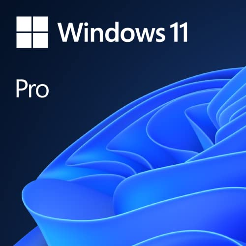

# Software

|[Home](README.md) | 
| -------- |

  
*Microsoft Windows 11 Pro OEM - DVD 64-bit*

### Why Consider Software?
Most people do not consider the software that will be running on their computer, yet an inability to run certain software well is commonly what prompts someone buys a new computer. You should research what software you are using and whether or not you want to meet the minimum needs of that software or to go beyond and be able to use and push the software without struggle.

### Operating System
When considering what software you want your computer to be capabale of running, you must consider the OS you will run on the computer. There are some software that work only on certain OS. For example, SolidWorks only runs on Windows while Final Cut Pro only runs on MacOS. You have to determine which OS you want in order to choose which software you want, and, if there are issues, you will have to consider the possible ways to resolve these issues.

### What to Look For in Software
Software dictates what computer components you should invest in much more than people expect. A lot of software have a minimum specifications to run the software without struggle. You should use these specifications and consider which software has the highest component demand and try to match that one to the best of your ability. If you have the money, you can go beyond what that software demands of a computer in order to ensure that the software runs without issue. 

One of the main things to consider with software is the storage needed. This is because, on the other minimum specifications, you can go above or below this and still be able to run the software moderately well. For storage, though, you either have the space to download the software or you don't. There is no underestimating storage, you have to have the amount of space available on your drive to get the software.