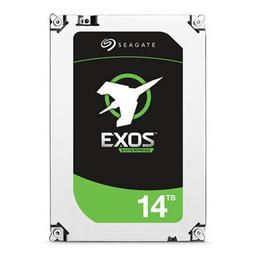
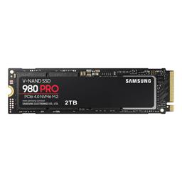

# Storage

|[Home](README.md) | 
| -------- |

|  |  | 
| --- | --- |
| *Seagate EXOS Enterprise 14 TB 3.5" 7200 RPM Internal Hard Drive* | *Samsung 980 Pro 2 TB M.2-2280 PCIe 4.0 X4 NVME Solid State Drive* |

### What is Storage?
If you have shopped for any electronic device, you have probably seen something about storage and that the option with the bigger number is more expensive. What exactly is storage, though?

Storage is the recording of data on a storage medium. Computer storage often comes in the form of a hard disk drive (HDD) or solid state drive (SSD). 

HDDs work by having rapid, rotating disks that are coated with magnetic material. Magnetic heads on a moving arm will read and write to these disk surfaces. Data from here will be accessed in [random-access manner](memory.md) which means that blocks of data can be stored or retrieved in any order. HDDs are non-volatile which means they retain stored data after being powered off. 

SSDs are a storage device that uses integrated circuit assemblies as memory to store data. It mainly uses electronic interfaces that work with the input/output of a HDD. SSDs are the newer, typically faster sibiling of the HDD. There is no spinning disk which makes them more resistant to physical shock and are quieter. 

Which is better?

| Category | HDD | SSD |
| --- | --- |  --- |
| Price | X |  |
| R/W Speed |  | X |
| Durability |  | X |

In general, SSDs are better. They are faster, more reliable, and more durable. The biggest issue is they are expensive. You can get the same amount of storage in a HDD for much cheaper than its SSD counter part. For some people, that is the deal breaker. 

### Internal Storage
In most modern computers, laptop and PCs, the internal storage is an SSD. Some computers have multiple storage devices, and some people build their computers with adding storage later in mind. Storage can be plugged into the PCIe[^1] or SATA lanes, or it can be plugged into the M.2 slots on some boards depending on board type and storage type. Some internal storage types have NVMe interface which currently has the fastest response and highest throughput for all protocols. PCIe is the faster competitor to SATA, and it uses NVMe protocol to speed this up further. This feature only exists on SSDs. 

Laptops currently do not have the same amount of storage customization options available as PC users do as the motherboard specifications for laptops depends upon the type of laptop. Furthermore laptop motherboards are made without customization in mind. Some laptops can upgrade their storage, but this would require understanding compatibility and how to replace the storage in a laptop.

### External Storage
Some people require external storage. External HDDs and SSDs comparisons are the same as internal, so choosing the right external storage is depending upon its purpose.

[^1]: To learn more about PCIe, visit the [motherboard](motherboard.md) page.